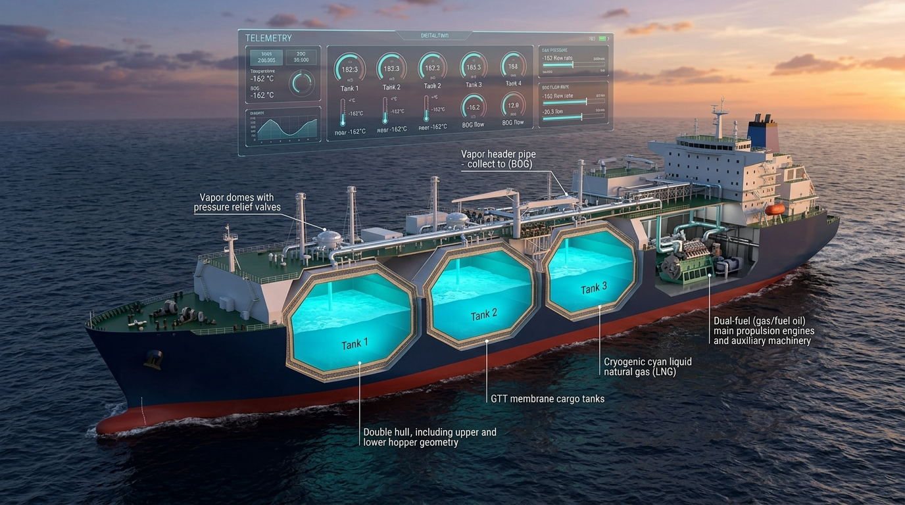

<p align="center">
  
</p>

# BOG Simulator (Boil-Off Gas Simulator for LNG Carriers)

A high-fidelity thermodynamic and hydrodynamic simulation platform for **Boil-Off Gas (BOG)** generation, cargo tank pressure management, and dual-fuel consumption dynamics in **174,000 m³ Membrane-Type Liquefied Natural Gas Carriers (LNGC)**.

Built with Python, Tkinter, NumPy, Pandas, and Matplotlib.

---

## Table of Contents
- [Overview](#overview)
- [Key Features](#key-features)
- [Physical & Mathematical Formulations](#physical--mathematical-formulations)
  - [1. Heat Inflow & BOG Production](#1-heat-inflow--bog-production)
  - [2. Hydrodynamics & Tank Geometry](#2-hydrodynamics--tank-geometry)
  - [3. Sloshing Scaling Factor (SSF)](#3-sloshing-scaling-factor-ssf)
  - [4. Tank Pressure Dynamics](#4-tank-pressure-dynamics)
  - [5. Fuel Gas Consumers](#5-fuel-gas-consumers)
- [System Architecture](#system-architecture)
- [Data & Configuration](#data--configuration)
- [Installation & Setup](#installation--setup)
- [How to Run](#how-to-run)
- [Using the Graphical Interface](#using-the-graphical-interface)
- [Roadmap & Future Upgrades (Post-MVP)](#roadmap--future-upgrades-post-mvp)
- [References & Documentation](#references--documentation)

---

## Overview

> [!NOTE]
> **Project Status: Initial MVP**
> This repository represents a functional **Minimum Viable Product (MVP)** created to demonstrate core LNG cargo tank thermodynamic behavior, consumer fuel-gas balancing, and real-time HMI visualization. Further architectural and thermodynamic upgrades are planned, althought feel free to contribute. (see [Roadmap](#roadmap--future-upgrades-post-mvp)).

Liquefied Natural Gas (LNG) is transported at cryogenic temperatures (approx. $-160\ ^\circ\text{C}$ / $113\text{ K}$) under near-atmospheric pressures. Despite state-of-the-art tank insulation, ambient heat ingress from surrounding sea water, atmospheric air, and cofferdams continuously evaporates a fraction of the cargo, generating **Boil-Off Gas (BOG)**.

Without intervention, BOG accumulation causes rapid pressure build-up inside the cargo tanks, threatening containment integrity. In modern LNG carriers, this gas is managed by feeding it as fuel into:
- **Two-stroke high-pressure dual-fuel main propulsion engines (ME-GI)**
- **Four-stroke dual-fuel auxiliary generator sets (DFDE)**
- **Gas Combustion Units (GCU)** for thermal oxidation during excess BOG generation or port/canal idle conditions.

**BOG Simulator** enables marine engineers, naval architects, and researchers to simulate, monitor, and optimize cargo tank pressure and fuel gas management over entire voyage profiles under varying sea states and weather conditions.

---

## Key Features

- **Multi-Tank Modeling**: Simulates 4 individual membrane cargo tanks using a **simplified polygonal prismatic geometry** (incorporating upper and lower corner chamfers) calibrated against genuine volume sounding tables.
- **Realistic Hydrodynamics & Heat Transfer**:
  - Calculates wetted submerged areas dynamically based on liquid sounding levels and ship draft.
  - Distinct heat transfer coefficients for sea water, atmospheric air, and cofferdam bulkheads, calibrated to yield an overall vessel Boil-Off Rate (BOR) of **0.10% – 0.15% per day** in alignment with GTT Mark III / NO96 membrane tank standards.
  - Accounts for sea-state-induced liquid sloshing effects.
- **Thermodynamic Rigor**:
  - Interpolates methane ($CH_4$) boiling point against absolute tank pressure.
  - Tracks liquid level and filling ratios using actual vessel calibration/sounding tables.
  - Net mass-balance vapor pressure modeling using the ideal gas law.
- **Consumer Fleet Simulation**:
  - **2x MAN B&W ME-GI** Main Propulsion Engines: RPM-dependent fuel gas consumption.
  - **4x Wärtsilä DFDE** Auxiliary Generators: 2x W6L34DF and 2x W8L34DF with kW power output load curves.
  - **1x Gas Combustion Unit (GCU)**: Operational up to 3,300 kg/h for overpressure relief.
- **Real-World Voyage Environment**:
  - Driven by **actual voyage variables and telemetry recorded from a real LNG carrier operated by a Greek-interest shipping company**, including hourly ambient air temperature, sea surface temperature, barometric pressure, and wind speed / Beaufort sea state.
- **Interactive Tkinter GUI**:
  - Real-time visual representation of all 4 cargo tanks with dynamic liquid level indicators.
  - Full control panel to toggle consumers, alter loads (RPM/kW/rate), and monitor total fuel gas demand.
  - Step-by-step (1-hour increments) or continuous simulation execution.
- **Post-Voyage Analytics**:
  - Automated dual-axis plotting with Matplotlib: Tank Pressure (mbar) and Fuel Consumption (kg/h) vs. Voyage Time (hours).

---

## Physical & Mathematical Formulations

### 1. Heat Inflow & BOG Production
The heat ingress rate $\dot{Q}$ [W] into each cargo tank is determined by:

$$\dot{Q}_{\text{total}} = \left( \dot{Q}_{\text{sea}} + \dot{Q}_{\text{air}} + \dot{Q}_{\text{coff}} \right) \times \text{SSF}$$

Where:

$$
\dot{Q}_i = U_i \cdot A_i \cdot (T_{i} - T_{\mathrm{liquid}})
$$

- $U_{\text{sea}} = 0.08\ \text{W/(m}^2\cdot\text{K)}$
- $U_{\text{air}} = 0.10\ \text{W/(m}^2\cdot\text{K)}$
- $U_{\text{coff}} = 0.12\ \text{W/(m}^2\cdot\text{K)}$
- $\text{SSF}$: Sloshing Scaling Factor

> [!NOTE]
> **Calibration of Heat Transfer Coefficients ($U$)**:
> The overall heat transfer coefficients ($U_{\text{sea}}$, $U_{\text{air}}$, $U_{\text{coff}}$) have been empirically derived and calibrated such that the vessel's cumulative daily Boil-Off Rate ($\text{BOR}$) falls closely within the design range of **$0.10\% - 0.15\%\ \text{per day}$**, in full accordance with international maritime standards and manufacturer design benchmarks for membrane containment systems (**GTT Mark III** or **NO96**):
>
> $$\text{BOR}_{\text{daily}} = \frac{m_{\text{BOG, 24h}}}{M_{\text{LNG, total}}} \times 100\% \approx 0.10\% - 0.15\% \ \text{per day}$$

The resulting Boil-Off Gas mass flow rate $\dot{m}_{\text{BOG}}$ [kg/s] is:

$$\dot{m}_{\text{BOG}} = \frac{\dot{Q}_{\text{total}}}{L_{\text{LNG}}}$$

(Latent heat of vaporization $L_{\text{LNG}} = 510{,}000\ \text{J/kg}$ ).

### 2. Hydrodynamics & Tank Geometry
In actual LNG carriers, membrane containment systems (such as GTT Mark III or NO96) feature intricate corrugated membranes, secondary barriers, and complex insulation arrangements. For the purposes of this simulator, **the geometry of the cargo tanks has been simplified into an idealized polygonal prismatic model**:
- **$h_1$**: Upper corner chamfer height [m] (top wing/hopper slope)
- **$h_2$**: Lower corner chamfer height [m] (bottom bilge hopper slope)
- **$\text{Breadth, Height, Length}$**: Overall rectangular envelope dimensions [m]

This analytical simplification allows fast, closed-form geometric partitioning of the wetted submerged surface areas ($A_{\text{sea}}$, $A_{\text{air}}$, $A_{\text{coff}}$) as a function of instantaneous liquid sounding level $z_{\text{level}}$ and vessel draft $T_{\text{draft}}$.

### 3. Sloshing Scaling Factor (SSF)
Vessel motions in rough seas induce cargo sloshing, disrupting thermal stratification, destroying vapor-liquid boundary layers, and increasing the effective heat transfer surface area.

> [!IMPORTANT]
> **Linear Simplification**: For the sake of simplification in this initial MVP, the Sloshing Scaling Factor ($\text{SSF}$) is calculated linearly based on the Beaufort sea state number ($\text{BN}$):

$$\text{SSF} = 
\begin{cases} 
1.0 + 0.03 \cdot \text{BN} & \text{for Laden voyage (L)} \\
1.0 + 0.05 \cdot \text{BN} & \text{for Ballast voyage (B)}
\end{cases}$$

*(Notice higher sensitivity during Ballast voyages due to lower filling ratios and increased liquid free-surface motion. In subsequent versions, this will be replaced with an advanced statistical model).*

### 4. Tank Pressure Dynamics
The rate of pressure change in the cargo tank vapor header is computed via the mass-balance derivative of the ideal gas law:

$$\Delta P = \frac{R \cdot \bar{T}_{\text{vapor}}}{V_{\text{vapor, total}} \cdot M_{\text{CH}_4}} \cdot \left( \sum_{k=1}^{4} \dot{m}_{\text{BOG}, k} + \dot{m}_{\text{prod}} - \dot{m}_{\text{cons}} \right) \cdot \Delta t$$

Where:
- $R = 8.314\ \text{J/(mol}\cdot\text{K)}$
- $M_{\text{CH}_4} = 0.016034\ \text{kg/mol}$
- $\bar{T}_{\text{vapor}}$: Mean vapor phase temperature across tanks [K]
- $V_{\text{vapor, total}}$: Cumulative vapor space across all connected tanks [m³]
- $\dot{m}_{\text{cons}}$: Total instantaneous fuel gas consumption across active consumers [kg/s]

### 5. Fuel Gas Consumers

- **MAN B&W ME-GI Propulsion Engines**:
  $$\dot{m}_{\text{MEGI}}\ (\text{kg/h}) = 0.00441 \cdot (\text{RPM})^3 - 0.042 \cdot (\text{RPM})^2 + 0.95 \cdot \text{RPM}$$
  *(Operating range: 45 to 73 RPM)*

- **Wärtsilä DFDE Auxiliary Generators**:
  - **W6L34DF** (1,000 – 3,000 kW):
    $$\dot{m}_{\text{W6L}}\ (\text{kg/h}) = 1.35 \times 10^{-5} \cdot P^2 + 0.0885 \cdot P + 99.2$$
  - **W8L34DF** (1,400 – 4,000 kW):
    $$\dot{m}_{\text{W8L}}\ (\text{kg/h}) = 1.01 \times 10^{-5} \cdot P^2 + 0.0885 \cdot P + 132.3$$

- **Gas Combustion Unit (GCU)**:
  - User-configurable burning rate: 0 to 3,300 kg/h.

---

## System Architecture

```
bog-sim-1.1/
├── data/                                # Data catalogs & configurations
│   ├── calibration_tables/              # Sounding / gauge tables for Tanks 1-4
│   │   ├── Table_0.csv
│   │   ├── Table_1.csv
│   │   ├── Table_2.csv
│   │   └── Table_3.csv
│   ├── enviromental/                    # Weather & oceanographic voyage data
│   │   └── weather.csv
│   ├── thermodynamics/                  # Methane saturation curves
│   │   └── Boiling_points_CH4.csv
│   └── vessel_configs/                  # Ship and tank geometry parameters
│       └── vessel_174k_membrane.toml
├── docs/                                # Technical manuals & reference papers
├── resources/                           # UI graphical assets & banner
│   ├── banner.jpg                       # Hero banner image
│   ├── dfde_img.png
│   ├── gcu_hmi.png
│   └── megi_img.png
├── src/
│   └── bog_simulator/
│       ├── __init__.py
│       ├── __main__.py                  # Application entry point
│       ├── config.py                    # Physical constants & path definitions
│       ├── core/                        # Domain models
│       │   ├── consumers/               # ME-GI, DFDE, GCU consumer models
│       │   ├── environment.py           # Voyage conditions & weather updates
│       │   ├── producer.py              # Gas production source
│       │   ├── tank.py                  # MembraneTank thermodynamic model
│       │   └── vessel.py                # LNGC vessel coordinator
│       ├── physics/                     # Engineering physics modules
│       │   ├── heat_transfer.py         # Convective/conductive heat transfer
│       │   ├── hydrodynamics.py         # Wetted surface geometry & sloshing
│       │   ├── per.py                   # Time rate conversions (sec/hour)
│       │   └── thermodynamics.py        # Pressure build-up & saturation curves
│       ├── ui/                          # GUI presentation layer (Tkinter)
│       │   ├── app.py                   # Simulation_GUI root window
│       │   ├── components.py            # Reusable UI widgets & environmental HUD
│       │   ├── control_panel.py         # Machinery & consumer control panel
│       │   ├── tank_view.py             # Canvas rendering for Tanks 1-4
│       │   └── consumers_ui/            # HMI widgets for ME-GI, DFDE, and GCU
│       └── utils/                       # Supporting utilities
│           ├── data_loader.py           # TOML / CSV file loaders
│           ├── resize_img.py            # Image asset resizer
│           └── statistics.py            # Time-series collector & Matplotlib plotter
├── pyproject.toml                       # Packaging metadata (PEP 517/518/621)
├── requirements.txt                     # Project dependencies
└── README.md
```

---

## Data & Configuration

- **`vessel_174k_membrane.toml`**: Configures ship draft, voyage mode (`L` for Laden, `B` for Ballast), cofferdam temperature, initial conditions for all 4 cargo tanks (temperature, liquid volume, pressure, geometry), and initial machinery states.
- **`weather.csv`**: Contains hourly chronological records **based on actual environmental and navigational variables recorded during a real voyage of an authentic LNG carrier**. Data fields include:
  - `date`: Timestamp along the voyage track
  - `apparent_temperature`: Ambient air temperature [°C]
  - `sea_surface_temperature`: Sea water temperature [°C]
  - `pressure_msl`: Mean sea level atmospheric pressure [mbar]
  - `wind_speed_10m`: Wind speed / Beaufort sea state number
- **`calibration_tables/Table_*.csv`**: Exact millimeter-by-millimeter level gauge readings mapped to cubic meters of liquid volume for each tank.

---

## Installation & Setup

### Prerequisites
- Python 3.11 or higher (Python 3.12+ fully supported)
- Standard packages: `tkinter` (bundled with standard Python distributions on Windows/macOS)

### 1. Clone the repository
```bash
git clone https://github.com/giannisf97/bog-simulator.git
cd bog-simulator
```

### 2. Set up a virtual environment (recommended)
```bash
# Windows (PowerShell)
python -m venv venv
.\venv\Scripts\Activate.ps1

# Linux / macOS
python3 -m venv venv
source venv/bin/activate
```

### 3. Install dependencies
```bash
pip install -r requirements.txt
```

*(Alternatively, install the package in editable mode: `pip install -e .`)*

---

## How to Run

Run the simulator directly via the package entrypoint:

```bash
python -m bog_simulator
```

Or execute directly with Python from the project root:

```bash
python src/bog_simulator/__main__.py
```

Or, if installed via `pip install -e .`, simply run:

```bash
bog-sim
```

---

## Using the Graphical Interface

Upon launching, the graphical interface opens with two main sections:

1. **Cargo Tanks Monitor (Left Side)**:
   - Displays real-time status for **Tank 1, Tank 2, Tank 3, and Tank 4**.
   - Features animated level gauge bars illustrating cargo depletion over time.
   - Shows numerical readouts for:
     - **Tank Pressure** [mbar]
     - **Avg. Liquid Temperature** [°C]
     - **Avg. Vapor Temperature** [°C]
     - **LNG Volume** [m³]
     - **Vapor Volume** [m³]
     - **LNG Level / Sounding** [m]

2. **Machinery Control Panel (Right Side)**:
   - **Main Engines (ME-GI)**: Adjust RPM (45 – 73) and Start/Stop each engine.
   - **Diesel Generators (DFDE)**: Adjust kW output (1000 – 4000 kW) and toggle operation.
   - **GCU**: Set gas combustion rate (0 – 3,300 kg/h) and toggle burning.
   - **Environmental HUD**: Displays current simulation date/time, atmospheric pressure, air temperature, sea water temperature, and sea state.
   - **Total Gas Consumption Indicator**: Real-time display of aggregate fuel gas burn rate in kg/h.
   - **Simulation Controls**:
     - **Start**: Initiates continuous simulation (advances 1 voyage hour per second).
     - **Pause**: Halts time progression to allow machinery adjustment.
     - **Step**: Advances simulation by exactly 1 hour.

3. **Voyage Completion & Analysis**:
   - When the voyage dataset concludes, a completion dialog appears and Matplotlib renders the post-voyage performance chart (Tank Pressure & Fuel Gas Consumption vs. Time).

---

## Roadmap & Future Upgrades (Post-MVP)

This project currently operates as an initial **Minimum Viable Product (MVP)**. Planned technical enhancements for upcoming versions include:

- **Vectorization of Scalar Values and Calculations**:
  - Refactor iterative scalar loops and state tracking across individual tanks and consumers into vectorized NumPy matrix operations.
  - Significantly improve runtime throughput, enabling sub-second multi-day simulations and Monte Carlo sensitivity analyses.

- **Advanced Equations of State (Peng-Robinson EOS) & Statistical Modeling**:
  - Implement cubic equations of state, specifically the **Peng-Robinson (PR)** model (or GERG-2008), to accurately simulate non-ideal vapor-liquid equilibrium (VLE) of multi-component LNG mixtures (Methane, Ethane, Propane, Nitrogen) beyond pure methane assumptions.
  - Incorporate statistical / machine learning methods and higher-order empirical correlations for dynamic Boil-Off Rate (BOR) and multi-boundary layer heat transfer estimations.

- **Reliquefaction Plant Equipment**:
  - Model sub-cooling and BOG reliquefaction machinery (e.g., partial/full reliquefaction plants utilizing Nitrogen Claude or reverse Brayton refrigeration cycles).
  - Simulate boil-off gas compressors, cold boxes, phase separators, and returning condensed sub-cooled LNG back into the cargo tanks to control pressure without venting or forced combustion.

- **Statistical Modeling of Sloshing Scaling Factor (SSF)**:
  - In subsequent releases, the current linear SSF calculation will be replaced with an advanced statistical / hydrodynamic model.
  - Predict sloshing-induced thermal enhancement factors using probabilistic models trained on wave spectral parameters (significant wave height $H_s$, peak wave period $T_p$), vessel motion Response Amplitude Operators (RAOs), and filling-ratio resonance bands.

- **Enhanced Post-Simulation Statistical Analysis & Reporting**:
  - Extend post-voyage findings beyond standard pressure and consumption time-series charts.
  - Compute comprehensive voyage Key Performance Indicators (KPIs): cumulative BOG generated vs. consumed/burned, daily Boil-Off Rate percentage (BOR %/day), energy efficiency indices, GCU thermal dissipation losses, and tank pressure threshold excursion frequencies.
  - Provide automated statistical summary tables and export options (CSV, PDF summary reports, and interactive HTML dashboards).

---

## References & Documentation

### Academic Literature & Peer-Reviewed Research
- **Saltzgaver, R., & Migliore, C. (2022)**: *Modelling of Boil-Off and Sloshing Relevant to Future Cryogenic Carriers*. Energies, 15(6), 2046. [https://doi.org/10.3390/en15062046](https://doi.org/10.3390/en15062046) *(available in `docs/research/`)*

### Industry Standards & Containment Design
- **GIIGNL (International Group of Liquefied Natural Gas Importers) (2021)**: *LNG Custody Transfer Handbook*, 6th Edition. *(available in `docs/manuals/`)*
- **Gaztransport & Technigaz (GTT) (2020)**: [*Membrane Containment Systems*](https://www.gtt.fr/activities/gtt-energy/technologies-expertise/membranes/markiii).

### Marine Machinery & Propulsion Specifications
- Various Product Guides

### Technical Documentation (Project Repository)
Found inside the local [`docs/`](docs/) directory:
- **`docs/manuals/giignl_custody_transfer_handbook_6.0_-_may_21_0-1 (1).pdf`**: Official custody transfer and calculation protocols.
